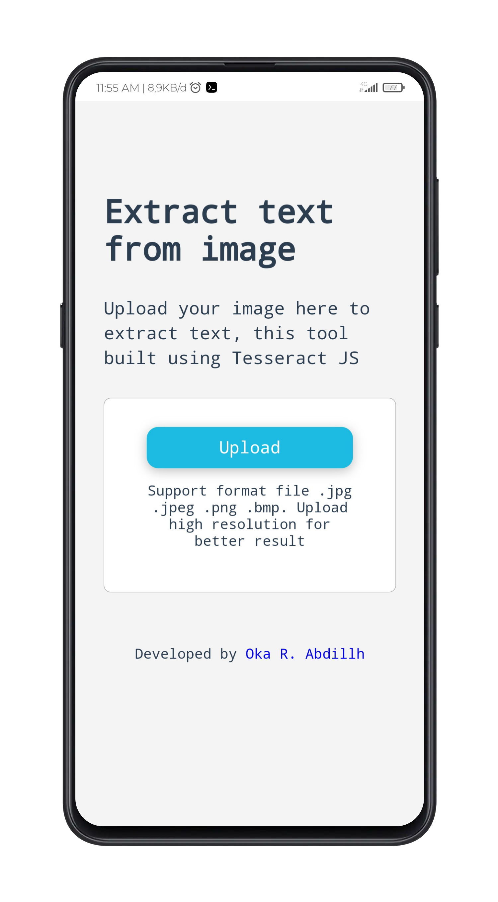

<h3 align="center">OCR TOOL</h3>

Extract Text From an Image

### About
this is my project in building a simple tool to extract text from an image. 

I am implementing a Tesseract JS library in my project.

### Languages and Tools
- Vue Js 3
- SCSS
- Tesseract JS
- Termux
- Vite Js
- Acode code editor

### Clone This Repo
- <code>git clone https://github.com/or-abdillh/ocr-project.git </code>
- <code>cd ocr-project</code>
- <code>npm install</code>
- <code>npm run dev</code>
- 
### Demo 
- [OCR TOOL](https://ocr-project.vercel.app/)
- [Instagram](https://www.instagram.com/p/CWpvfAvLnx7/?utm_medium=copy_link)

[Oka R Abdillah ](http://github.com/or-abdillh)
 
Last edited on : 25/11/2021